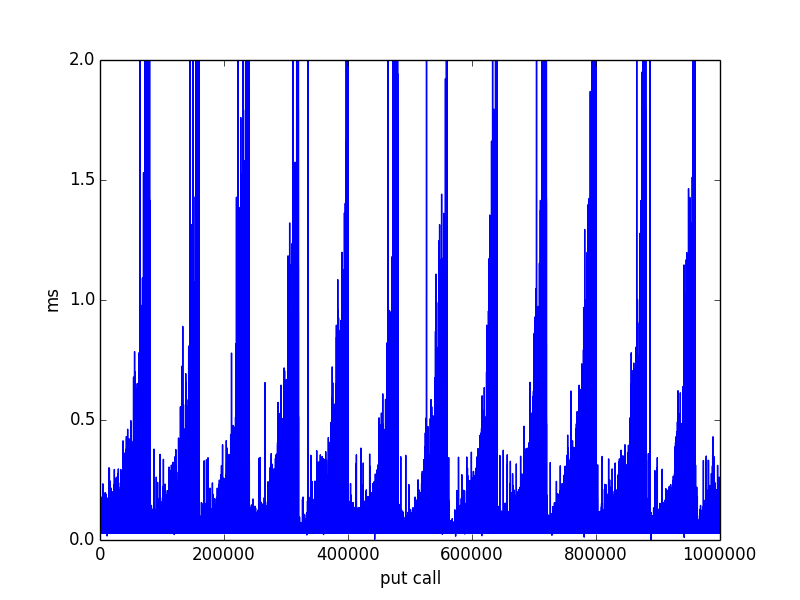

[](https://badge.fury.io/py/cogdb) [](https://travis-ci.org/arun1729/cog) [](https://opensource.org/licenses/MIT) [](https://codecov.io/gh/arun1729/cog)

# Cog - A pure Python Graph Database
# 


## Installing Cog
```
pip install cogdb
```
Cog is a graph database implemented purely in python. Torque is Cog's graph query language. Cog also provides a low level API to its fast key-value store.

Cog is ideal for python applications that does not require a full featured database. Cog can easily be used as a library from within a Python application. It is written purely in Python so it has no dependencies other than Python standard library.

## Torque is a query language inspired by Gizmo
Cog stores graph as triples:

  ```vertex <predicate> vertex```
  
### Sample data
```
alice follows bob
bob follows fred
bob status cool_person
charlie follows bob
charlie follows dani
dani follows bob
dani follows greg
dani status cool_person
emily follows fred
fred follows greg
greg status cool_person
```
### Loading triples:

```python
from cog.torque import Loader
from cog.torque import Graph

loader = Loader('path/to/dbdir')
loader.load_triples('path/to/triple_file', "graph_name")

```

### Loading edge list:

```python
from cog.torque import Loader
from cog.torque import Graph
loader = Loader('path/to/dbdir')
loader.load_edgelist('path/to/edgelist', "graph_name")
```

## Torque query examples

### starting from a vertex, follow all outgoing edges and list all vertices
```python
from cog.torque import Graph
g = Graph(graph_name="people", cog_dir='path/to/dbdir')
g.v("bob").out().all()
```
> {"result": [{"id": "greg", "id": "alice"}]}

### starting from a vertex, follow all outgoing edges and count vertices
```python
from cog.torque import Graph
g = Graph(graph_name="people", cog_dir='path/to/dbdir')
g.v("bob").out().count()

```
> '2'

### starting from a vertex, follow all out going edges and tag them

```python
from cog.torque import Graph
g = Graph(graph_name="people", cog_dir='path/to/dbdir')
g.v("bob").out().tag("source").out().tag("target").all()

```
> {"result": [{"source": "<fred>", "id": "<greg>", "target": "<greg>"}]}

By tagging the vertices 'source' and 'target', the resulting graph can be visualized using [Sigma JS](http://sigmajs.org/) 

### starting from a vertex, follow all incoming edges and list all vertices
```python
from cog.torque import Graph
g = Graph(graph_name="people", cog_dir='path/to/dbdir')
g.v("bob").inc().all()
```
> {"result": [{"id": "alice", "id": "dani"}]}

### Adding vertices

```python
from cog.torque import Graph
g = Graph(graph_name="people", cog_dir='path/to/dbdir')
g.put("A","letters","B").put("B","letters","C").put("C","letters","D")
g.put("Z","letters","D")
g.v("A").out(["letters"]).out().out().inc().all()

```
Query makes multiple hops on outgoing edges.

> {"result": [{"id": "C"}, {"id": "Z"}]}'


## Low level key-value store API:
Every record inserted into Cog's key-value store is directly persisted on to disk. It stores and retrieves data based 
on hash values of the keys, it can perform fast look ups (O(1) avg) and fast (O(1) avg) inserts. 

```python

from cog.database import Cog

cogdb = Cog('path/to/dbdir')

# create a namespace
cogdb.create_namespace("my_namespace")

# create new table
cogdb.create_table("new_db", "my_namespace")

# put some data
cogdb.put(('key','val'))

# retrieve data 
cogdb.get('key')

# put some more data
cogdb.put(('key2','val2'))

# scan
scanner = cogdb.scanner()
for r in scanner:
    print r
    
# delete data
cogdb.delete('key1')

```

## Config

If no config is provided when creating a Cog instance, it will use the defaults:

```
COG_PATH_PREFIX = "/tmp"
COG_HOME = "cog-test"
```

### Example updating config

```python
from cog import config
config.COG_HOME = "app1_home"
data = ('user_data:id=1','{"firstname":"Hari","lastname":"seldon"}')
cog = Cog(config)
cog.create_namespace("test")
cog.create_table("db_test", "test")
cog.put(data)
scanner = cog.scanner()
for r in scanner:
    print r

```

### Advance config

```
INDEX_BLOCK_LEN = 10
INDEX_CAPACITY = 2000
INDEX_LOAD_FACTOR = 80
```

Default index capacity of 2000 is on the lower end, it is intend for light usage of Cog such as using it as a hash-table data structure.
For larger indexing use case, INDEX_CAPACITY should be set to larger number otherwise it will lead to too many open index files.

## Performance

Put and Get calls performance:

> ops/second: 15685

The perf test script is included with the tests: insert_bench.py

INDEX_LOAD_FACTOR on an index determines when a new index file is created, Cog uses linear probing to resolve index collisions.
Higher INDEX_LOAD_FACTOR leads slightly lower performance on operations on index files that have reached the target load.

#### Put performance profile

